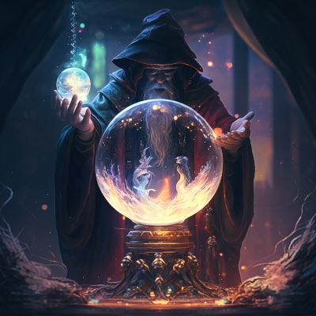
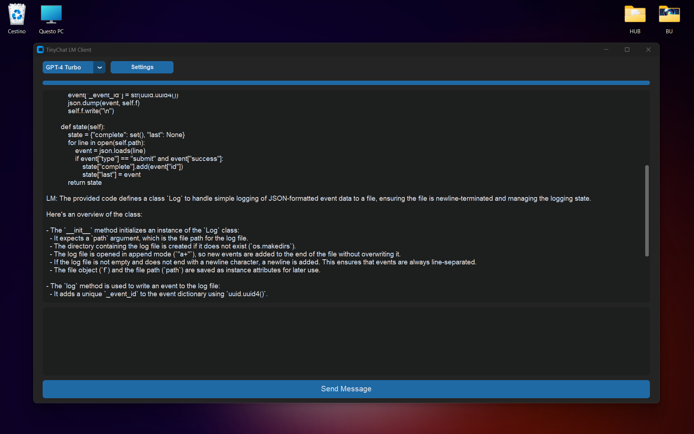

<div align="center">


<h1>TinyChat</h1>

*A simple GUI client for modern Language Models*

**TinyChat is built with simplicity in mind. Its minimalistic Python code is designed for straightforward comprehension. More features will likely come, but it will stay tiny. Promised!**
</div>


## How to Use
**The project was just started, so right now you need to go the developer route**


```
# Clone repo and enter main folder
git clone https://github.com/pymike00/tinychat.git
cd tinychat

# Create Virtual Environment
python -m venv venv

# Activate Virtual Environment
source venv/bin/activate on Linux / Mac OS
.\venv\Scripts\Activate.ps1 on Windows Powershell

# Install requirements
pip install -r requirements.txt

# Run application
python -m tinychat
```

<br>

## Clean Interface
**Select your favorite model and start chatting**



## Supports all Major Models
**Supports all major chat models from OpenAI, Mistral and Cohere official cloud APIs:**

- [x] GPT-4 Turbo
- [x] GPT-3.5-Turbo
- [x] Mixtral 8x7B
- [x] Mistral 7B
- [x] Mistral Medium
- [x] Cohere Chat

<br>

*To use the models you will need an API Key from <a href="https://platform.openai.com/api-keys">OpenAI</a> / <a href="https://console.mistral.ai/user/api-keys/">Mistral</a> / <a href="https://dashboard.cohere.com/api-keys/">Cohere</a>. Follow the links to get started!*


<br>

## Project just started. Here is what you can expect for the future:

- [ ] Dependency-less
- [ ] Support for chat history
- [ ] Support for multimodality
- [ ] Support for local models
- [ ] Currently storing api_keys in a gitignored secrets.json. Considering better options.